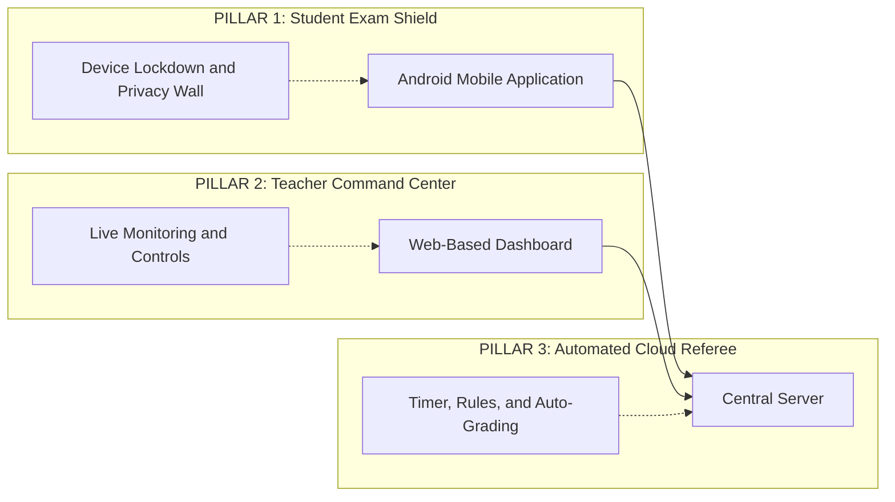
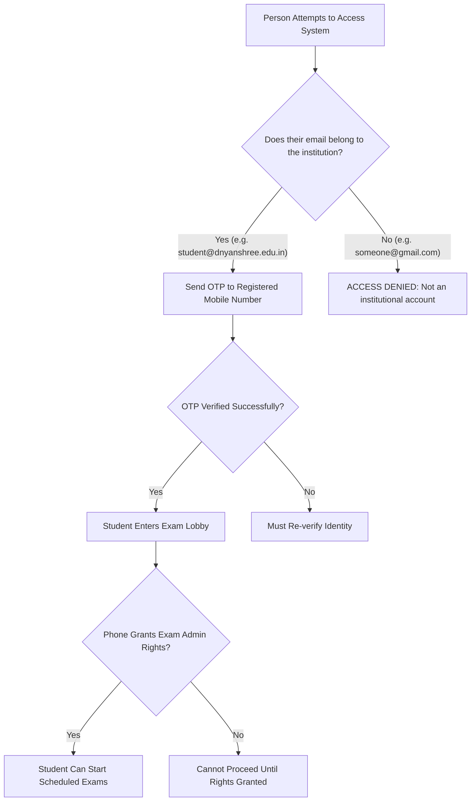
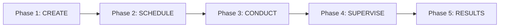
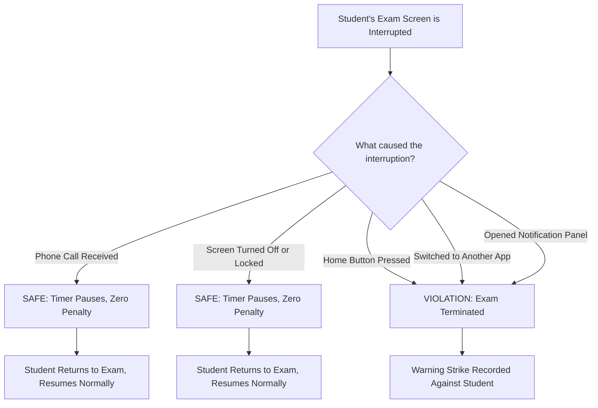
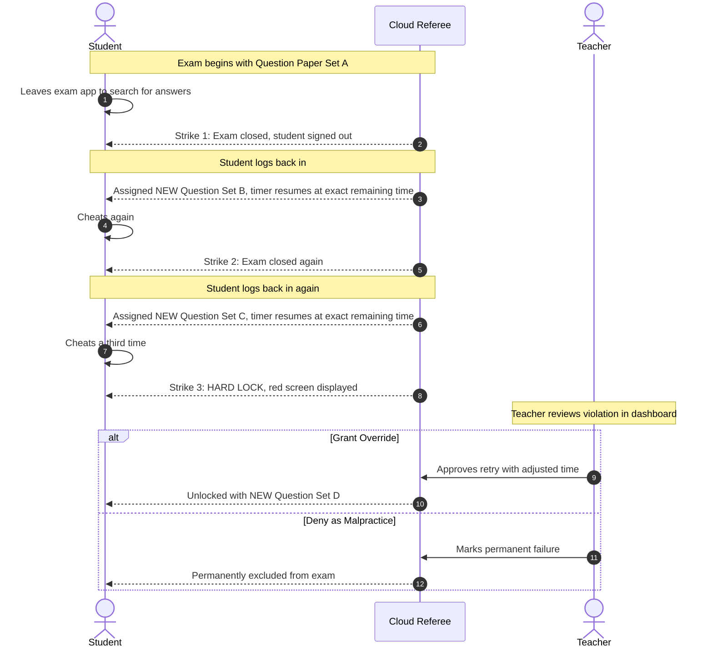
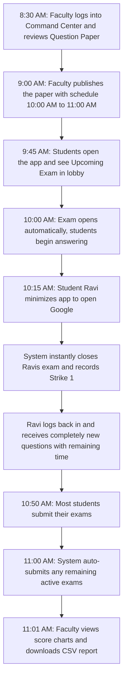

# 🎓 Smart Proctored Examination System

## Executive Presentation Guide

> Prepared for: Institutional Leadership, Academic Deans, Examination Controllers & Administrative Authorities

---

## 📌 Document Summary

This guide explains, in non-technical language, how our **Smart Proctored Examination Platform** works, why it is needed, what problems it solves, and the measurable advantages it brings to the institution. Every section uses simple language supported by visual diagrams.

---

## 1. 🌟 The Problem We Are Solving

Traditional online examination methods have a fundamental weakness: **the institution has no control over what a student does on their personal device during a test.**

### ❌ What Happens Today (Without Our System)

| Problem | How Students Exploit It |
| :--- | :--- |
| Open browser access | Student minimizes the test to search Google for answers |
| Screenshot capability | Student captures exam questions and shares them on WhatsApp groups |
| No time protection | Student disconnects internet to "pause" the clock, reconnects later with extra time |
| Same questions on retry | If caught cheating, the student already knows all the answers on their second attempt |
| No live supervision | Teacher discovers cheating only after the exam is over, when it is too late to act |
| Manual paper checking | Faculty spends hours grading MCQ papers that a computer could score instantly |

### ✅ What Changes With Our System

| Solution | How Our Platform Handles It |
| :--- | :--- |
| **Device Lockdown** | The moment an exam starts, the phone becomes a single-purpose exam device. No other app can be opened. |
| **Screenshot Protection** | Any screenshot or screen recording attempt produces a completely black image. Questions cannot be captured. |
| **Server-Controlled Timer** | The countdown clock runs on our central server, not on the student's phone. Disconnecting the internet does not pause or reset the timer. |
| **Fresh Questions on Every Retry** | If a student cheats and re-enters, they receive a **completely different set of questions** from the subject pool. |
| **Live Teacher Dashboard** | Faculty can watch every student's progress in real time and intervene instantly with one click. |
| **Automatic Grading** | All MCQ answers are scored the instant a student submits, with results available immediately. |

---

## 2. 🏗️ System Architecture: Three Connected Pillars

Our platform consists of three tools working together seamlessly:

| Pillar | Used By | Purpose |
| :--- | :--- | :--- |
| 📱 **Student Exam Shield** | Students | Converts the student's Android phone into a locked exam kiosk. Only the exam screen is accessible. |
| 🖥️ **Teacher Command Center** | Faculty, HODs, Exam Cell | A website where educators create papers, set schedules, monitor live exams, review violations, and download results. |
| 🤖 **Cloud Referee** | Runs Automatically | An impartial server engine that manages timers, enforces rules, reassigns papers, and auto-submits expired exams. |

---

## 3. 🔐 Who Can Access the System?

Security begins before a single question is displayed. Our platform includes multiple verification layers:

### Key Access Controls:
* **Institutional Email Whitelisting:** Only accounts registered under the institution's official email domain (for example, `@dnyanshree.edu.in`) are permitted. Personal Gmail, Yahoo, or Outlook accounts are automatically rejected.
* **Phone OTP Verification:** Each student profile is linked to a verified mobile number using one-time passwords (OTP), preventing impersonation where one student attempts to take the exam for another.
* **Device Administrator Permission:** Before the first exam, students must grant the app special device privileges. This allows the system to disable the camera hardware, prevent screenshots, and enforce the lockdown. Without this consent, the exam cannot begin.

---

## 4. 📝 Exam Lifecycle: From Creation to Results

The complete journey of an examination through our system follows five clear phases:

### Phase 1: Create — Question Paper Preparation
* Faculty logs into the **Teacher Command Center** from any computer.
* Creates a new exam paper by entering: **Title**, **Subject**, and **Duration** (in minutes).
* Adds MCQ questions one by one, each with four options and the correct answer marked.
* Questions can include text, mathematical formulas, circuit diagrams, or medical images.
* All uploaded images are automatically compressed to reduce file size, ensuring fast loading even on slower networks.

### Phase 2: Schedule — Timetable Configuration
* Faculty sets the **Opening Date & Time** (e.g., Monday, 10:00 AM) and **Closing Date & Time** (e.g., Monday, 11:30 AM).
* Students attempting to start the exam before the opening time or after the closing time are automatically blocked by the server.
* Multiple papers can be created for the same subject (used for automatic reassignment if a student cheats—explained in Section 6).

### Phase 3: Conduct — Student Takes the Exam
* Student opens the app on their Android phone and signs in with their institutional credentials.
* The app verifies device admin permissions and enters the exam lobby.
* Upon starting, the phone enters **lockdown mode**:
  * Camera is disabled at the hardware level
  * Screenshots and screen recordings produce black images
  * AI assistants and overlay tools are blocked
  * Only the exam screen is accessible
* Questions appear one at a time. After answering, the student taps **Next** and cannot return to previous questions.
* A visible countdown timer shows time remaining.

### Phase 4: Supervise — Faculty Monitors Live
* On the web dashboard, faculty sees a live table of every student currently taking the exam.
* Each student row shows: name, current question number, time remaining, and a color-coded status badge.
* If a violation occurs, the student's row highlights immediately with warning indicators.
* Faculty can click to review details and take action (override or malpractice) without waiting for the exam to end.

### Phase 5: Results — Automatic Scoring & Reports
* The moment a student submits (or the timer expires and auto-submits), all answers are scored instantly against the correct answer key.
* The dashboard displays score distributions, batch averages, and violation history as visual charts.
* Complete historical records can be downloaded as CSV/Excel spreadsheets for institutional archives, accreditation documentation, or parent communication.

---

## 5. 🛡️ Intelligent Anti-Cheat: Fair to Accidents, Strict on Cheating

One of the most critical design decisions in our system is: **How do we distinguish between a genuine emergency and a deliberate cheating attempt?**

Our platform handles this automatically using real-time device signals:

### What is Protected (Zero Penalty):
* 📞 **Incoming phone calls** — A parent or guardian calling during an exam will not penalize the student. The timer freezes until the call ends.
* 🔒 **Screen lock or sleep** — If the student accidentally presses the power button, the timer pauses safely.

### What Triggers a Violation:
* 🏠 Pressing the Home button to leave the exam
* 📱 Switching to any other app (browser, calculator, messaging)
* 🔔 Pulling down the notification shade

> [!NOTE]
> The system makes these distinctions automatically using hardware-level signals from the phone's operating system. No manual configuration is needed by faculty, and no student input is required.

---

## 6. ⚠️ The Three-Strike Rule: How Cheating is Managed

When a student commits a violation, our system follows a structured, transparent, and fair escalation process:

### The Three Key Principles:

**Principle 1 — Fresh Questions Every Time**
> When a student cheats and returns, they never see the same questions again. A brand-new paper is assigned from the subject's question pool. This makes looking up answers completely pointless because the questions have changed.

**Principle 2 — Exact Time Preservation**
> If a student had **4 minutes and 30 seconds** remaining when they cheated, their new paper starts with exactly **4 minutes and 30 seconds**. No time is gained or lost during the logout/re-login process. The server tracks time with precision.

**Principle 3 — Faculty Has Final Authority**
> After 3 strikes, the system locks the student out automatically. But the decision to forgive or fail remains entirely in the hands of the faculty member. The teacher can:
> * **Grant Override:** Unlock the student with a specified number of additional minutes and a fresh question set.
> * **Mark Malpractice:** Permanently disqualify the student from the exam.

---

## 7. 📊 What Faculty & Administration Can See

The Teacher Command Center provides comprehensive visibility across all examinations:

### Live Monitoring Dashboard
| Information Displayed | Description |
| :--- | :--- |
| Student Name & ID | Which student is currently in the exam |
| Current Question Number | How far the student has progressed (e.g., Question 7 of 25) |
| Time Remaining | Live countdown showing exact seconds left |
| Status Badge | Color-coded: 🟢 Active, 🟡 Paused, 🟠 Warning, 🔴 Blocked |
| Violation Count | Number of warnings accumulated (0, 1, 2, or 3) |
| Quick Actions | One-click buttons: Review, Override, or Deny |

### Analytics & Reports
| Feature | What It Shows |
| :--- | :--- |
| Score Distribution Chart | Bar graph showing how many students scored in each percentage range |
| Violation Frequency Graph | Trend line showing cheating attempt patterns across exam sessions |
| Batch Performance Summary | Average scores, highest/lowest marks, completion rates |
| Individual Student Cards | Detailed per-student breakdown: answers given, time taken per question, violations |
| CSV/Excel Export | One-click download of complete exam data for institutional records |

---

## 8. ⚡ Operational Advantages for the Institution

| Advantage | Explanation |
| :--- | :--- |
| **📅 Precise Scheduling** | Set exact opening and closing times. The system enforces them automatically — no early birds, no latecomers. |
| **⏰ Automatic Collection** | When time expires, the exam auto-submits instantly. No more "my internet was slow" excuses. |
| **💾 Bandwidth Friendly** | All exam images and diagrams are automatically compressed before delivery. Works smoothly on slow mobile data and congested campus Wi-Fi. |
| **🔄 Real-Time Updates** | Dashboard updates instantly without page refreshes. Faculty sees student activity the moment it happens. |
| **📈 Instant Results** | MCQ scoring happens automatically upon submission. No manual paper checking required. |
| **🗂️ Audit-Ready Archives** | Complete examination history is permanently stored and downloadable, supporting NAAC, NBA, and internal audit requirements. |
| **📱 No Special Hardware** | Students use their existing personal Android smartphones. The institution does not need to purchase tablets, laptops, or lab computers for examinations. |
| **👥 Scalable Capacity** | The cloud-based referee can handle hundreds of simultaneous exam-takers without performance degradation. |

---

## 9. 🔄 A Real-World Walkthrough: Exam Day Scenario

To make the system tangible, here is a typical examination day from start to finish:

**Detailed Timeline:**

| Time | What Happens |
| :--- | :--- |
| **8:30 AM** | Prof. Sharma logs into the Command Center from their office laptop. Reviews the 25-question MCQ paper on Basic Electronics. Everything looks good. |
| **9:00 AM** | Prof. Sharma publishes the paper and sets the exam window: **10:00 AM to 11:00 AM** with a **45-minute duration**. |
| **9:45 AM** | Students open the app on their phones. The exam lobby shows "Basic Electronics — Starts at 10:00 AM". The Start button is greyed out. |
| **10:00 AM** | The Start button activates. Students begin. Their phones enter lockdown mode. The 45-minute countdown begins on the server. |
| **10:15 AM** | Student **Ravi** presses the Home button to open Google. The system instantly detects the unauthorized exit. Ravi's exam closes. Strike 1 recorded. |
| **10:16 AM** | Ravi logs back in. The server assigns him a **completely different question set** (Paper Set B). His timer resumes at **30 minutes remaining** (exactly where it was when he cheated). |
| **10:35 AM** | Student **Priya** receives a phone call from her parent. Her exam timer pauses automatically. No violation recorded. She finishes the call and resumes her exam. |
| **10:45 AM** | Most students finish and tap Submit. Their scores are calculated instantly. |
| **11:00 AM** | The exam window closes. Any students still active have their exams auto-collected by the server. |
| **11:01 AM** | Prof. Sharma opens the Analytics tab. Score distribution charts are already generated. She downloads the full CSV report for departmental records. |

---

## 10. ❓ Frequently Asked Questions

| Question | Answer |
| :--- | :--- |
| **Do students need expensive phones?** | No. Any standard Android smartphone (Android 8.0 or newer) works. No special hardware is required. |
| **What if a student's phone battery dies mid-exam?** | The server preserves their exact progress and remaining time. When the student charges their phone and logs back in, they can resume from where they left off (with the same timer). |
| **Can students cheat by using two phones?** | Each student account can only have one active exam session at a time. Starting on a second device would terminate the first session. Additionally, screenshots are blocked, so there is nothing to photograph from a second device's camera. |
| **What if the campus Wi-Fi goes down during an exam?** | The server-side timer does not penalize network disconnections. Students reconnect and resume. All previously submitted answers are already saved on the server. |
| **Can the exam be conducted on laptops or desktops?** | The student exam app is Android-only by design. Web browsers cannot enforce the hardware-level security locks (camera disabling, screenshot blocking, app-switching prevention) that our anti-cheat system requires. |
| **How many students can take the exam simultaneously?** | The cloud infrastructure scales automatically. Hundreds of concurrent students are supported without performance issues. |
| **Is student data secure?** | Yes. All communication between the app and server is encrypted. Student answers are stored in secured cloud databases with role-based access controls. Only authorized faculty can view results. |
| **Can we use this for multiple departments and subjects?** | Absolutely. Each paper is tagged with a subject and can be independently scheduled. Multiple departments can run exams simultaneously without interference. |

---

## 11. 🗺️ Future Roadmap

| Planned Enhancement | Description |
| :--- | :--- |
| **Push Notifications** | Students receive instant mobile alerts when exam schedules are published or when a teacher grants an override. |
| **Parent/Guardian Portal** | A read-only view where parents can see their ward's exam results and attendance. |
| **Multi-Language Support** | Question papers displayed in regional languages (Marathi, Hindi) alongside English. |
| **Offline Exam Mode** | For locations with unreliable internet, answers are cached locally and synced when connectivity returns. |
| **Advanced Analytics** | Question-level difficulty analysis, topic-wise performance breakdowns, and semester-over-semester trend comparisons. |

---

> *This platform merges uncompromising examination integrity with intuitive administrative simplicity — ensuring a fair assessment environment for students and complete peace of mind for institutional leadership.*

---
*Document Version: 1.0 | Last Updated: August 2026*
